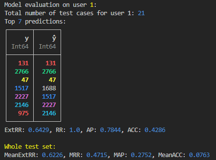

# NeuralCollaborativeFiltering.jl  [](https://github.com/JuliaTeachingCTU/ImageInspector.jl/blob/master/LICENSE) [](https://github.com/poludmik/NeuralCollaborativeFiltering.jl/actions/workflows/CI.yml?query=branch%3Amaster)


A Julia implementation of three different recommender systems based on the concept of Neural Collaborative Filtering. It utilizes the MovieLens dataset, consisting of users, their movie ratings, movie genres, etc. The goal is to predict how much a certain user will like a particular movie, i.e., **(user, movie) -> rating** prediction.

> For a quick start, check out an example of the training process in  [scripts/testing_package.jl](https://github.com/poludmik/NeuralCollaborativeFiltering.jl/blob/master/scripts/testing_package.jl). Activate the environment by running the `] activate .` command from within the `scripts/` folder and run the script with `include("testing_package.jl")`.


## Implemented recommender systems
As for now, 3 models are implemented in this package:

| Model | Reference | Details |
|-------|------|------|
| Recommender system based on Generalized Matrix Factorization | Figure 1 (left) from [Neural Collaborative Filtering vs. Matrix Factorization Revisited (2020)](https://arxiv.org/pdf/2005.09683.pdf) | 2 Embedding layers with a dot product |
| Recommender system based on Multi Layer Perceptron | Figure 1 (right) from [Neural Collaborative Filtering vs. Matrix Factorization Revisited (2020)](https://arxiv.org/pdf/2005.09683.pdf) | Concatenate 2 Embedding layers and pass the result to the MLP |
| Recommender system based on a combination of Generalized Matrix Factorization and Multi Layer Perceptron similarity | Figure 3 from [Neural Collaborative Filtering 2017](https://arxiv.org/pdf/1708.05031.pdf) | Combining both of the above by concatenating their outputs and passing to the NeuMF layer afterwards |

All three models utilize Embedding layers that maintain an embedding vector for each user and each movie in the dataset.

The `build_model()` function leverages Julia's multiple dispatch capability, constructing a model object based on the argument types, e.g.:
```julia
m_dot = build_model(DotProductModel, df_train, df_test, embeddings_size=60)
m_both = build_model(GMFAndMLPModel, df_train, df_test, embeddings_size=60, share_embeddings=true)
```


## Dataset
I downloaded the MovieLens dataset from [here](https://grouplens.org/datasets/movielens/#:~:text=recommended%20for%20education%20and%20development) and stored it in the `datasets/` folder. Then I wrote an ugly and unoptimized [filter_movielens.jl](https://github.com/poludmik/NeuralCollaborativeFiltering.jl/blob/master/scripts/filter_movielens.jl) to extract the data that is actually needed for this project. The main resulting data files ([train CSV file](https://github.com/poludmik/NeuralCollaborativeFiltering.jl/blob/master/datasets/ml-latest-small/user_movie_pairs_for_coll_filtr_train.csv) and [test CSV file](https://github.com/poludmik/NeuralCollaborativeFiltering.jl/blob/master/datasets/ml-latest-small/user_movie_pairs_for_coll_filtr_test.csv)) are structured in a format compatible for training all three models:

| user | movie | score |
|------|-------|-------|
| 159  | 2752  | 0.85  |
| 610  | 3228  | 0.19  |
| ...  | ...   | ...   |

However, this project can easily be extended contain other types of recommender systems, that, e.g. would also consider the features of movies.
That's why I've also extracted 20 movie genre features for each of them and divided data to [trainset](https://github.com/poludmik/NeuralCollaborativeFiltering.jl/blob/master/datasets/ml-latest-small/movie_genre_df_train.csv) and [testset](https://github.com/poludmik/NeuralCollaborativeFiltering.jl/blob/master/datasets/ml-latest-small/movie_genre_df_test.csv) according to the previous 'user' x 'movie' x 'score' split. Features are boolean encoded, each column represents a specified genre.


## Model evaluation
Other than staring at the decreasing test loss during training it is also good to see how the rankings produced by the system effect the order and the accuracy of several recommendations to a single user.

> **For example**, let's take the case from the image below: for user number $1$, we have the ground truth order of recommendations with movie ids: $y = [131, 2766, 47, 1517, ...]$. The movie $131$ is the most relevant one. The recommender system produces the following order of movie relevances: $\hat y = [131, 2766, 47, 1688, ...]$. We can see that the top 3 reccomendations were predicted right where they should be, which is good. The recommended movie number $1688$ isn't even relevant according to $y$; this is bad. Then, the $1517, 2227$ and $2146$ are all shifted down by one rank; this is not that bad, but not good. Describing it with "it's good" or "it's bad" terms is ok, but we want a numerical evaluation.



There are 4 different metrics implemented in [metrics.jl](https://github.com/poludmik/NeuralCollaborativeFiltering.jl/blob/master/src/evaluation/metrics.jl). More specifically:

* **Accuracy** computes the proportion of elements that match element-wise between the ground truth vector $y$ and the predicted vector $\hat y$.

* **Average precision** calculates the average precision of a ranked list of items.

* **Reciprocal rank**, a well-known concept, calculates the inverse relative position of the first true item. Later used in the MRR calculation.

* **Extended Reciprocal rank**, inspired by [3]. Measures the order as well as the relative distance of the rankings.

Then, those functions are utilized by the functions in [evaluate_model.jl](https://github.com/poludmik/NeuralCollaborativeFiltering.jl/blob/master/src/evaluation/evaluate_model.jl) to calculate MRR (Mean Reciprocal Rank), MAP (Mean Average Precision), MeanAcc (Mean Accuracy), and MeanExtRR (Mean Extended Reciprocal Rank), which are the same metrics but averaged across all users.


## Results

My primary objective for this project was to create a Julia package featuring examples of neural network models from both [1] and [2], which, to my knowledge, don't yet exist.

So far, I have not dedicated significant time to optimizing the hyperparameters of the models (such as the sizes of embeddings, learning rates, etc.), resulting in inconsistent performance. However, after running multiple tests to ensure the models' capacity for learning, I've empirically observed that the most sophisticated of the three models, the GMFAndMLPModel, tends to outperform the others by a few percentage points. It's worth noting that these results could improve substantially with more focused efforts on hyperparameter tuning. 

The best results I have achieved are as follows: (**MeanExtRR** = 0.6229, **MRR** = 0.4728, **MAP** = 0.2803, **MeanACC** = 0.0858).

## References
[1] [Neural Collaborative Filtering (2017)](https://arxiv.org/pdf/1708.05031.pdf)
 
[2] [Neural Collaborative Filtering vs. Matrix Factorization Revisited (2020)](https://arxiv.org/pdf/2005.09683.pdf)
 
[3] [Extended Reciprocal Rank](https://towardsdatascience.com/extended-reciprocal-rank-ranking-evaluation-metric-5929573c778a)

